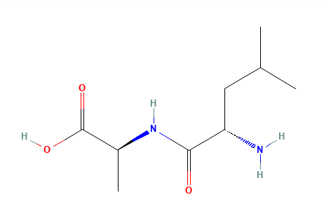
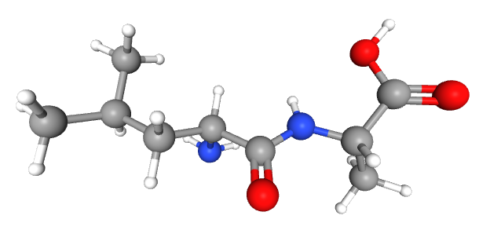

# 🧬 RDKit Internal Coordinates Analysis

## Molecular Geometry Analysis of L-Leucyl-L-alanine Using Python and RDKit

This project demonstrates the conversion of Cartesian coordinates into internal coordinates for the **L-Leucyl-L-alanine** molecule using Python and RDKit.

The workflow includes:
- Molecular geometry optimization
- Bond length calculation
- Bond angle analysis
- Dihedral angle computation
- Z-matrix generation
- Coordinate transformation analysis

The entire workflow was performed in a Linux terminal environment using Python scripting and RDKit.

---

# 📌 2D Molecule Structure



---

# 📌 3D Molecule Structure



---

# 📖 Project Overview

In computational chemistry, molecular structures can be represented using Cartesian coordinates, where atoms are defined using:

0

Although Cartesian coordinates define exact atomic positions, they are not always chemically intuitive.

To better describe molecular geometry, internal coordinates are used, including:
- Bond lengths
- Bond angles
- Dihedral angles

Internal coordinates provide a more meaningful understanding of:
- Molecular shape
- Atomic connectivity
- Conformational flexibility

This representation is widely used in:
- Molecular modeling
- Structural bioinformatics
- Drug discovery
- Geometry optimization
- Molecular simulations

---

# ⚙️ Computational Workflow

The following workflow was implemented:

1. Generate molecule from SMILES notation  
2. Add hydrogen atoms  
3. Optimize molecular geometry using UFF  
4. Extract Cartesian coordinates  
5. Calculate:
   - Bond lengths
   - Bond angles
   - Dihedral angles  
6. Generate Z-matrix representation  

---

# 🛠️ Technologies Used

- Python
- RDKit
- Linux Terminal
- Computational Chemistry
- Molecular Geometry Analysis

---

# 📂 Repository Structure

```text
RDKit-Internal-Coordinates/
│
├── internal_coordinates.py
├── README.md
├── requirements.txt
│
├── images/
│   ├── molecule_2d.png
│   ├── molecule_3d.png
│
├── outputs/
│   ├── bond_lengths.txt
│   ├── bond_angles.txt
│   ├── dihedral_angles.txt
│   ├── z_matrix.txt
│
└── LICENSE
```

---

# 🚀 Applications

This workflow has applications in:
- Computational Chemistry
- Molecular Modeling
- Structural Bioinformatics
- Drug Discovery
- QSAR Analysis
- Molecular Dynamics
- Geometry Optimization

---

# 🎯 Learning Outcomes

Through this project, I explored:
- Molecular coordinate systems
- Internal coordinate representation
- RDKit workflows
- Linux-based scientific computing
- Python applications in computational chemistry
  
---

# 📜 License

This project is open-source and available under the MIT License.
